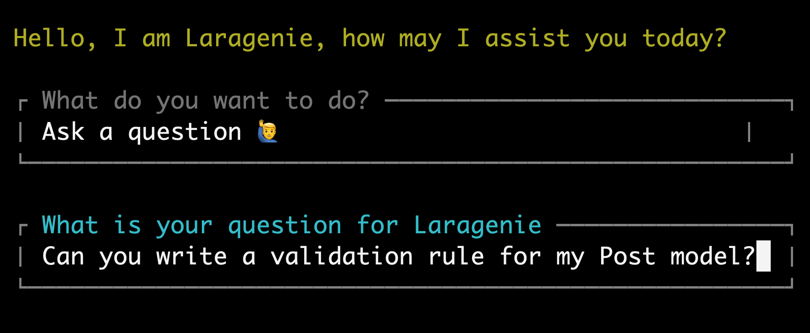
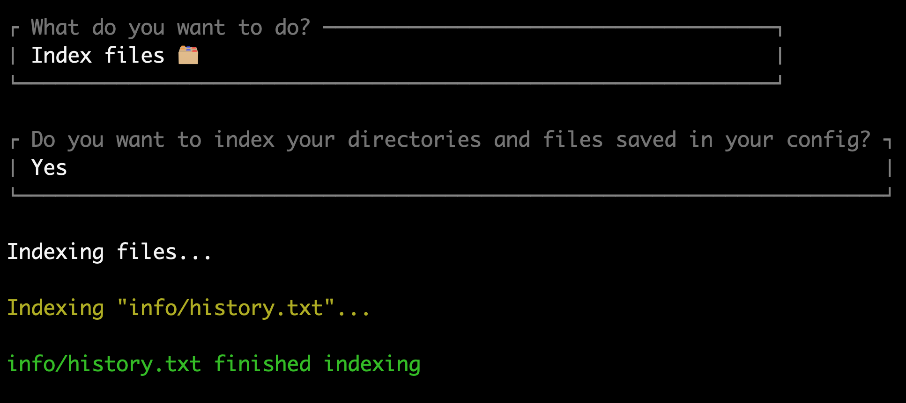
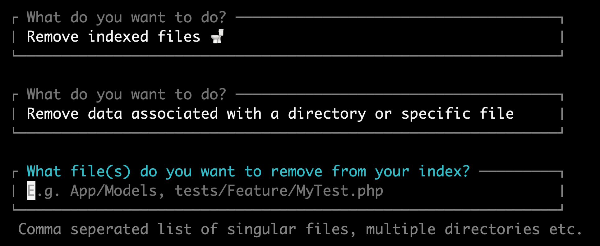
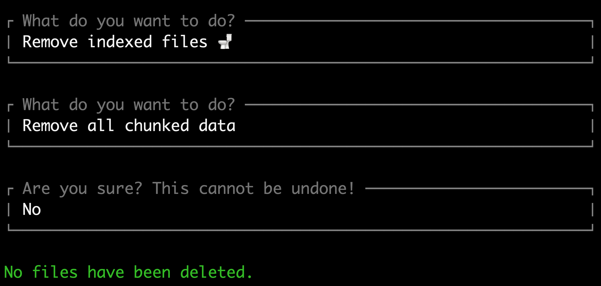

# Laragenie - AI built to understand your codebases

[](https://packagist.org/packages/joshembling/laragenie)
[](https://packagist.org/packages/joshembling/laragenie)

Laragenie is an AI chatbot that runs on the command line from your Laravel app. It will be able to read and understand any of your codebases following a few simple steps:

1. Set up your env variables [OpenAI and Pinecone](#openai-and-pinecone)
2. Publish and update the Laragenie config
3. Index your files and/or full directories
4. Ask your questions

It's as simple as that! Accelerate your workflow instantly and collaborate seamlessly with the quickest and most knowledgeable 'colleague' you've ever had.

This is a particularly useful CLI bot that can be used to:

-   Onboard developer's to new projects.
-   Assist both junior and senior developers in understanding a codebase, offering a cost-effective alternative to multiple one-on-one sessions with other developers.
-   Provide convenient and readily available support on a daily basis as needed.

You are not limited to indexing files based in your Laravel project. You can use this for monorepo's, or indeed any repo in any language. You can of course use this tool to index files that are not code-related also.

All you need to do is run this CLI tool from the Laravel directory. Simple, right?! 🎉


> [!NOTE]  
> If you are upgrading from version ^1.0.63 > 1.1, there is a change to Pinecone environment variables. Please see [OpenAI and Pinecone](#openai-and-pinecone).

## Contents

-   [Requirements](#requirements)
-   [Installation](#installation)
-   [Useage](#usage)
    -   [OpenAI and Pinecone](#openai-and-pinecone)
    -   [Running Laragenie on the command line](#running-laragenie-on-the-command-line)
    -   [Ask a question](#ask-a-question)
        - [Force AI](#force-ai)
    -   [Index files](#index-files)
        - [Indexing files outside of your Laravel project](#indexing-files-outside-of-your-laravel-project)
    -   [Remove indexed files](#remove-indexed-files)
    -   [Stopping Laragenie](#stopping-laragenie)
-   [Debugging](#debugging)
    -   [API Keys](#api-keys)
-   [Changelog](#changelog)
-   [Contributing](#contributing)
-   [Security Vulnerabilities](#security-vulnerabilities)
-   [Credits](#credits)
-   [Licence](#license)

## Requirements

-   Laravel 10 or greater
-   PHP 8.1 or greater

This package uses [Laravel Prompts](https://laravel.com/docs/10.x/prompts#fallbacks) which supports macOS, Linux, and Windows with WSL. Due to limitations in the Windows version of PHP, it is not currently possible to use Laravel Prompts on Windows outside of WSL.

For this reason, Laravel Prompts supports falling back to an alternative implementation such as the Symfony Console Question Helper.

## Installation

You can install the package via composer:

```bash
composer require joshembling/laragenie
```

You can publish and run the migrations with:

```bash
php artisan vendor:publish --tag="laragenie-migrations"
php artisan migrate
```

If you don't want to publish migrations, you must toggle the database credentials in your Laragenie config to false. (See config file details below).

You can publish the config file with:

```bash
php artisan vendor:publish --tag="laragenie-config"
```

This is the contents of the published config file:

```php
return [
    'bot' => [
        'name' => 'Laragenie', // The name of your chatbot
        'welcome' => 'Hello, I am Laragenie, how may I assist you today?', // Your welcome message
        'instructions' => 'Write in markdown format. Try to only use factual data that can be pulled from indexed chunks.', // The chatbot instructions
    ],

    'chunks' => [
        'size' => 1000, // Maximum number of characters to separate chunks
    ],

    'database' => [
        'fetch' => true, // Fetch saved answers from previous questions
        'save' => true, // Save answers to the database
    ],

    'extensions' => [ // The file types you want to index
        'php',
        'blade.php',
        'js',
    ],

    'indexes' => [
        'directories' => [], // The directores you want to index e.g. ['App/Models', 'App/Http/Controllers', '../frontend/src']
        'files' => [], // The files you want to index e.g. ['tests/Feature/MyTest.php']
        'removal' => [
            'strict' => true, // User prompt on deletion requests of indexes
        ],
    ],

    'openai' => [
        'embedding' => [
            'model' => 'text-embedding-3-small', // Text embedding model 
            'max_tokens' => 5, // Maximum tokens to use when embedding
        ],
        'chat' => [
            'model' => 'gpt-4-turbo-preview', // Your OpenAI GPT model
            'temperature' => 0.1, // Set temperature between 0 and 1 (lower values will have less irrelevance)
        ],
    ],

    'pinecone' => [
        'topK' => 2, // Pinecone indexes to fetch
    ],
];
```

## Usage

### OpenAI and Pinecone

This package uses [OpenAI](https://openai.com/) to process and generate responses and [Pinecone](https://www.pinecone.io/) to index your data.

You will need to create an OpenAI account with credits, generate an API key and add it to your `.env` file:

```
OPENAI_API_KEY=your-open-ai-key
```

> [!IMPORTANT]  
> If you are using a Laragenie version prior to 1.1 and do not want to upgrade, go straight to [Legacy Pinecone](#legacy-pinecone).

You will need to create a Pinecone account. There are two diferent types of account you can set up: 

1. Serverless
2. Pod-based index (legacy)

As of early 2024, Pinecone recommend you start with a serverless account. You can optionally set up an account with a payment method attached to get $100 in free credits, however, a free account allows up to 100,000 indexes - likely more than enough for any small-medium sized application.

Create an index with 1536 dimensions and the metric as 'cosine'. Then generate an api key and add these details to your `.env` file:

```
PINECONE_API_KEY=an-example-pinecone-api-key
PINECONE_INDEX_HOST='https://an-example-url.aaa.gcp-starter.pinecone.io'
```

*Tip: Your host can be seen in the information box on your index page, alongside the metric, dimensions, pod type, cloud, region and environment.*

> [!TIP]  
> If you are upgrading to Laragenie ^1.1, you can safely remove the legacy environment variables: `PINECONE_ENVIRONMENT` and `PINECONE_INDEX`.

#### Legacy Pinecone

> [!NOTE]  
> This is for Laragenie versions prior to 1.1 only.

**Important: If you are using Laragenie 1.0.63 or prior, you must use a regular Pinecone account and NOT a serverless account. When you are hinted to select an option on account creation, ensure you select 'Continue with pod-based index'.**

Create an environment with 1536 dimensions and name it, generate an api key and add these details to your `.env` file:

```
PINECONE_API_KEY=your-pinecone-api-key
PINECONE_ENVIRONMENT=gcp-starter
PINECONE_INDEX=your-index
```

### Running Laragenie on the command line

Once these are setup you will be able to run the following command from your root directory:

```bash
php artisan laragenie
```

You will get 4 options:

1. Ask a question
2. Index files
3. Remove indexed files
4. Something else

Use the **arrow keys** to toggle through the options and **enter** to select the command.

### Ask a question



**Note: you can only run this action once you have files indexed in your Pinecone vector database (skip to the ‘Index Files’ section if you wish to find out how to start indexing).**

When your vector database has indexes you’ll be able to ask any questions relating to your codebase.

Answers can be generated in markdown format with code examples, or any format of your choosing. Use the `bot.instructions` config to write AI instructions as detailed as you need to. 

Beneath each response you will see the generated cost (in US dollars), which will help keep close track of the expense. Cost of the response is added to your database, if migrations are enabled.

*Costs can vary, but small responses will be less than $0.01. Much larger responses can be between $0.02–0.05.*

#### Force AI 

As previously mentioned, when you have migrations enabled your questions will save to your database.

However, you may want to force AI usage (prevent fetching from the database) if you are unsatisfied with the initial answer. This will overwrite the answer already saved to the database.

To force an AI response, you will need to end all questions with an `--ai` flag e.g.

`Tell me how users are saved to the database --ai`.

This will ensure the AI model will re-assess your request, and outputs another answer (this could be the same answer depending on the GPT model you are using).

### Index files



The quickest way to index files is to pass in singular values to the `directories` or `files` array in the Laragenie config. When you run the 'Index Files' command you will always have the option to reindex these files. This will help in keeping your Laragenie bot up to date.

Select 'yes', when prompted with `Do you want to index your directories and files saved in your config?`

```php 
'indexes' => [
    'directories' => ['App/Models', 'App/Http/Controllers'],
    'files' => ['tests/Feature/MyTest.php'],
    'removal' => [
        'strict' => true,
    ],
],
```

If you select 'no', you can also index files in the following ways: 
 
- Inputting a file name with it's namespace e.g. `App/Models/User.php`
- Inputting a full directory, e.g. `App`
    - If you pass in a directory, Laragenie can only index files within this directory, and not its subdirectories. 
    - To index subdirectories you must explicitly pass the path e.g. `App/Models` to index all of your models
- Inputting multiple files or directories in a comma separated list e.g. `App/Models, tests/Feature, App/Http/Controllers/Controller.php`
- Inputting multiple directories with wildcards e.g. `App/Models/*.php`
    - Please note that the wildcards must still match the file extensions in your `laragenie` config file.

#### Indexing files outside of your Laravel project

You may use Laragenie in any way that you wish; you are not limited to just indexing Laravel based files. 

For example, your Laravel project may live in a monorepo with two root entries such as `frontend` and `backend`. In this instance, you could move up one level to index more directories and files e.g. `../frontend/src/` or `../frontend/components/Component.js`.

You can add these to your `directories` and `files` in the Laragenie config:

```php 
'indexes' => [
    'directories' => ['App/Models', 'App/Http/Controllers', '../frontend/src/'],
    'files' => ['tests/Feature/MyTest.php', '../frontend/components/Component.js'],
    'removal' => [
        'strict' => true,
    ],
],
```

Using this same method, you could technically index any files or directories you have access to on your server or local machine.

**Ensure your extensions in your Laragenie config match all the file types that you want to index.**

```php
'extensions' => [
    'php', 'blade.php', 'js', 'jsx', 'ts', 'tsx', // etc...
],
```

*Note: if your directories, paths or file names change, Laragenie will not be able to find the index if you decide to update/remove it later on (unless you truncate your entire vector database, or go into Pinecone and delete them manually).*

### Removing indexed files



You can remove indexed files using the same methods listed above, except from using your `directories` or `files` array in the Laragenie config - this is currently for indexing purposes only. 

If you want to remove all files you may do so by selecting `Remove all chunked data`. **Be warned that this will truncate your entire vector database and cannot be reversed.**



To remove a comma separated list of files/directories, select the `Remove data associated with a directory or specific file` prompt as an option.

Strict removal, i.e. warning messages before files are removed, can be turned on/off by changing the 'strict' attribute to false in your config.

```php
'indexes' => [
    'removal' => [
        'strict' => true,
    ],
],
```

### Stopping Laragenie

You can stop Laragenie using the following methods:

-   `ctrl + c` (Linux/Mac)
-   Selecting `No thanks, goodbye` in the user menu after at least 1 prompt has run.

Have fun using Laragenie! 🤖

## Debugging

### API Keys
- If you have correctly added the required `.env` variables, but get an error such as "You didn't provide an API key", you may need to clear your cache and config:

```bash
php artisan config:clear
php artisan cache:clear
```

- Likewise, if you get a 404 response and a Saloon exception when trying any of the four options, it's likely you do not have a non-serverless Pinecone database set up. Please see [OpenAI and Pinecone](#openai-and-pinecone).

## Changelog

Please see [CHANGELOG](CHANGELOG.md) for more information on what has changed recently.

## Contributing

Please see [CONTRIBUTING](CONTRIBUTING.md) for details.

## Security Vulnerabilities

Please review [our security policy](../../security/policy) on how to report security vulnerabilities.

## Credits

-   [Josh Embling](https://github.com/joshembling)
-   [All Contributors](../../contributors)

## License

The MIT License (MIT). Please see [License File](LICENSE.md) for more information.
